  

  

  
  
  

---

## 🧭 About Me

<table>
<tr>
<td width="50%" valign="top">

💼 **Consultant @ Capgemini** 
Enterprise React apps for Banking & Financial Services

🤖 **React Developer → AI Engineer** 
LLM integrations, AI agents and prompt-driven tooling

</td>
<td width="50%" valign="top">

👨‍🏫 **React JS Trainer** 
Turning real banking scenarios into practical lessons

🚀 **Indie SaaS Builder** 
Shipping my own AI products alongside my day job

</td>
</tr>
</table>

<b>📍 Chennai, India</b> · Open to senior React / AI engineering roles and collaborations

---

## 🔨 What I'm Building

<table>
<tr>
<td colspan="2" valign="top">

### 🎙 JavihAI — AI Interview Preparation Platform &nbsp; 
A full SaaS product I build and run end to end that helps job seekers practise and prepare for interviews — a desktop practice app plus a **Next.js** web app for sign-in, **Razorpay** billing, customer dashboard and app downloads, and an internal **admin panel** for users, support tickets, analytics and audit logs. SEO content pages, CI and auto-deploys included.

&nbsp;→ [web app](https://github.com/smartjaganrao/ai-interview-landing) · [admin panel](https://github.com/smartjaganrao/ai-interview-admin)

</td>
</tr>
<tr>
<td width="50%" valign="top">

### 🗳 Tamil Pulse
AI-powered public opinion platform for Tamil Nadu 2026 — built with Gemini AI.

 

&nbsp;[code](https://github.com/smartjaganrao/TN-PUBLIC-PULSE)

</td>
<td width="50%" valign="top">

### 📸 Event AI
AI SaaS for event & wedding photographers in India — **Smart Album AI** curation and **Find Me** guest-selfie search.

 

</td>
</tr>
<tr>
<td width="50%" valign="top">

### 🏥 Clinic Q
Patient queue management (web + mobile) — role-based dashboards for Admin, Doctor and Reception with real-time tracking.

 

</td>
<td width="50%" valign="top">

### 💰 FinSight
Personal financial advisor dashboard — ₹ formatting, financial health score and investment suggestions.

 

</td>
</tr>
</table>

  ✨ <b>Next up:</b> Prompt Optimiser — a desktop overlay that rewrites prompts from any input field &nbsp;·&nbsp; 📺 <b>Build With Jagan</b> — React + AI content for developers

---

## 🛠 Tech Stack

    
  

  
  
  
  
  
  

---

## 💡 Enterprise Highlights (BFSI)

| | |
|---|---|
| ⚡ **Performance** | Faster large banking apps with memoization, code-splitting and lazy loading |
| 🧩 **Reusability** | Component libraries shared across multiple product modules |
| 🔐 **Security** | Secure authentication flows with Okta |
| 🏗 **Architecture** | Micro-frontend and scalable frontend architecture decisions |

---

## 📂 Featured Repositories

  
  
  
  

More: <a href="https://github.com/smartjaganrao/Employee-Dasboard">Employee Dashboard</a> · <a href="https://github.com/smartjaganrao/Live-Weather-Application-in-React-JS">Live Weather App</a> · <a href="https://github.com/smartjaganrao/Advance-Javascript-Examples">Advanced JS Examples</a> · <a href="https://github.com/smartjaganrao?tab=repositories">all repositories →</a>

---

## 📈 GitHub Stats

  
  

  

---

  

